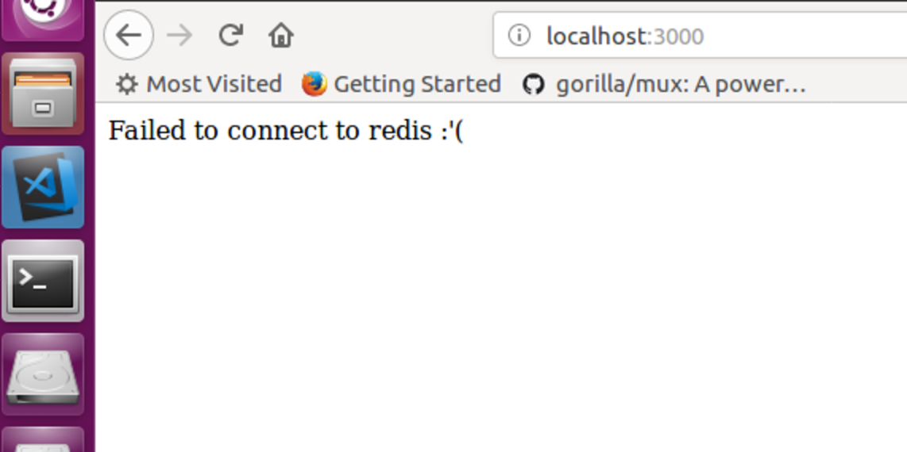
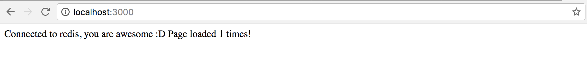

# Docker

What is Docker?\
[Read this article before starting the assignment](https://opensource.com/resources/what-docker)

## Part 1 - Getting started with docker:

[Use this guide to install docker (only do Part 1)](https://docs.docker.com/get-started/)

When you are finished you should be able to run:\
`docker run hello-world`\
and get the following:

```
Hello from Docker!
This message shows that your installation appears to be working correctly.

To generate this message, Docker took the following steps:
...(snipped)...
```

### FAQ

#### What Ubuntu do I have?

Run:\
`lsb_release -a`\
Should display (depending on your Ubuntu version):

```
Distributor ID:   Ubuntu
Description:      Ubuntu 16.04.3 LTS
Release:          16.04
Codename:         xenial
```

#### Why do I get permission denied when running docker?

You are trying to run a docker container or do the docker tutorial, but you only get an error message like this:

```
docker: Got permission denied while trying to connect to the Docker daemon socket at unix:///var/run/docker.sock: Post http://%2Fvar%2Frun%2Fdocker.sock/v1.26/containers/create: dial unix /var/run/docker.sock: connect: permission denied.
See 'docker run --help'.
```

_Solution:_

The error message tells you that your current user can’t access the docker engine, because you’re lacking permissions to
access the unix socket to communicate with the engine.

As a temporary solution, you can use `sudo` to run the failed command as root. However it is recommended to fix the
issue by adding the current user to the docker group:

Run this command in your favorite shell and then **completely log out of your account and log back in (if in doubt,
reboot!)**:

`sudo usermod -a -G docker $USER`

After doing that, you should be able to run the command without any issues. Run `docker run hello-world` as a normal
user in order to check if it works. Reboot if the issue still persists.

Logging out and logging back in is required because the group change will not have an effect unless your session is
closed.
[Solution from TECHOVERFLOW](https://techoverflow.net/2017/03/01/solving-docker-permission-denied-while-trying-to-connect-to-the-docker-daemon-socket/)

## Part 2

What you should finish in this part:

* [ ] Create a docker image
* [ ] Run an instance of your image (a docker container)
* [ ] Store your docker image on Docker Cloud
* [ ] Store all your code from the remainder of this assignment on GitHub, day2 folder

### Image vs Container

An instance of an image is called a container. You have an image, which is a set of layers as you describe. If you start
this image, you have a running container of this image. You can have many running containers of the same image.

### Your new development environment

In the past, if you were to start writing a Node app, your first order of business was to install a Node and other
dependencies onto your machine. But, that creates a situation where the environment on your machine has to be just so in
order for your app to run as expected; ditto for the server that runs your app.

With Docker, you can just grab a portable Node runtime as an image, no installation necessary. Then, your build can
include the base Node image right alongside your app code, ensuring that your app, its dependencies, and the runtime,
all travel together.

These portable images are defined by something called a Dockerfile.

### Define a container with a Dockerfile

Dockerfile will define what goes on in the environment inside your container. Access to resources like networking
interfaces and disk drives is virtualized inside this environment, which is isolated from the rest of your system, so
you have to map ports to the outside world, and be specific about what files you want to “copy in” to that environment.
However, after doing that, you can expect that the build of your app defined in this Dockerfile will behave exactly the
same wherever it runs.

### Dockerfile

Create an empty directory. Change directories (cd) into the new directory, create a file called Dockerfile,
copy-and-paste the following content into that file, and save it.

```Dockerfile
FROM node:carbon

WORKDIR /code

COPY package.json package.json

COPY app.js app.js

RUN npm install

CMD node app.js
```

This Dockerfile refers to a couple of files we haven’t created yet, namely `app.js` and `package.json`. Let’s create
those next.

### The app itself

Create two more files, `app.js` and `package.json`, and put them in the same folder with the Dockerfile. This completes
our app, which as you can see is quite simple. When the above Dockerfile is built into an image, `app.js` and
`package.json` will be present because of that Dockerfile’s `COPY` command.

`app.js`

```javascript
const express = require('express');
const redis = require('redis');

var app = express();
var client = redis.createClient(6379, 'my_redis_container', {
  retry_strategy: options => {
    return;
  },
});

app.get('/', (req, res) => {
  if (client.connected) {
    client.incr('page_load_count', (error, reply) => {
      var msg = 'Connected to redis, you are awesome :D' + 'Page loaded ' + reply + ' times!';
      res.statusCode = 200;
      res.send(msg);
      return;
    });
  } else {
    var msg = "Failed to connect to redis :'(";
    res.statusCode = 500;
    res.send(msg);
  }
});

app.listen(3000);
```

`package.json`

```javascript
{
  "name": "web",
  "version": "1.0.0",
  "description": "",
  "main": "app.js",
  "scripts": {
    "test": "echo \"Error: no test specified\" && exit 1"
  },
  "author": "",
  "license": "ISC",
  "dependencies": {
    "express": "^4.16.2",
    "redis": "^2.8.0"
  }
}
```

### Build the app

We are ready to build the app. Make sure you are still at the top level of your new directory. Here’s what ls should
show:

```
$ ls
Dockerfile		app.js			package.json
```

Now run the build command. This creates a Docker image, which we’re going to tag using -t so it has a friendly name.

```
docker build -t pagecounter .
```

Where is your built image? It’s in your machine’s local Docker image registry:

```
$ docker images

REPOSITORY            TAG                 IMAGE ID
pagecounter         latest              326387cea398
```

### Run the app

Run the app, mapping your machine’s port 3000 to the container’s published port 3000 using -p:

```
docker run -p 3000:3000 pagecounter
```

Go to the URL `http://localhost:3000` and you should see:  The app is simple REST
API that counts the number of GET requests made. The app tries to connect to a redis database using the default redis
(6379) port but since you don't have a redis database running the connection fails.

You can also use the curl command in a shell to view the same content.

```
$ curl http://localhost:3000

Failed to connect to redis :'(
```

Now let’s run the app in the background, in detached mode:

```
docker run -d -p 3000:3000 pagecounter
```

You get the long container ID for your app and then are kicked back to your terminal. Your container is running in the
background. You can also see the abbreviated container ID with docker container ls (and both work interchangeably when
running commands):

```
$ docker container ls

CONTAINER ID        IMAGE               COMMAND                   CREATED
1fa4ab2cf395        pagecounter        "/bin/sh -c 'node ..."     28 seconds ago
```

You’ll see that CONTAINER ID matches what’s on http://localhost:3000.

Now use docker container stop to end the process, using the CONTAINER ID, like so:

```
docker container stop 1fa4ab2cf395
```

**Pro Tip** When running commands that require the `CONTAINER ID`, e.g.\
`docker container stop 1fa4ab2cf395`\
it's usually enough to write the first three characters or so, i.e.\
`docker container stop 1fa`

### Share your image

To demonstrate the portability of what we just created, let’s upload our built image and run it somewhere else. After
all, you’ll need to learn how to push to registries when you want to deploy containers to production.

A registry is a collection of repositories, and a repository is a collection of images—sort of like a GitHub repository,
except the code is already built. An account on a registry can create many repositories. The docker CLI uses Docker’s
public registry by default.

Note: We’ll be using Docker’s public registry here just because it’s free and pre-configured, but there are many public
ones to choose from, and you can even set up your own private registry using Docker Trusted Registry.

### Log in with your Docker ID

If you don’t have a Docker account, sign up for one at [cloud.docker.com](https://cloud.docker.com/). Make note of your
username.

Log in to the Docker public registry on your local machine.

```
$ docker login
```

### Tag the image

The notation for associating a local image with a repository on a registry is username/repository:tag. The tag is
optional, but recommended, since it is the mechanism that registries use to give Docker images a version. Give the
repository and tag meaningful names for the context, such as week1:part2.

Now, put it all together to tag the image. Run docker tag image with your username, repository, and tag names so that
the image will upload to your desired destination. The syntax of the command is:

```
docker tag image username/repository:tag
```

For example:

```
docker tag pagecounter john/week1:part2
```

Run docker images to see your newly tagged image. (You can also use docker image ls.)

```
$ docker images
REPOSITORY               TAG                 IMAGE ID            CREATED             SIZE
pagecounter              latest              d9e555c53008        3 minutes ago       195MB
john/week1               part2               d9e555c53008        3 minutes ago       195MB
...
```

### Publish the image

Upload your tagged image to the repository:

```
docker push username/repository:tag
```

Once complete, the results of this upload are publicly available. If you log in to Docker Hub, you will see the new
image there, with its pull command.

Pull and run the image from the remote repository From now on, you can use docker run and run your app on any machine
with this command:

```
docker run -p 3000:3000 username/repository:tag
```

If the image isn’t available locally on the machine, Docker will pull it from the repository.

```
$ docker run -p 3000:3000 john/week1:part2
Unable to find image 'john/week1:part2' locally
part2: Pulling from john/week1
10a267c67f42: Already exists
f68a39a6a5e4: Already exists
9beaffc0cf19: Already exists
3c1fe835fb6b: Already exists
4c9f1fa8fcb8: Already exists
ee7d8f576a14: Already exists
fbccdcced46e: Already exists
Digest: sha256:0601c866aab2adcc6498200efd0f754037e909e5fd42069adeff72d1e2439068
Status: Downloaded newer image for john/week1:part2
 * Running on http://0.0.0.0:3000/ (Press CTRL+C to quit)
```

Note: If you don’t specify the :tag portion of these commands, the tag of :latest will be assumed, both when you build
and when you run images. Docker will use the last version of the image that ran without a tag specified (not necessarily
the most recent image). No matter where docker run executes, it pulls your image, along with Node and runs your code. It
all travels together in a neat little package, and the host machine doesn’t have to install anything but Docker to run
it.

### How do I know I'm done?

* [ ] I've created a docker image
* [ ] I ran an instance of my image (a docker container) and saw the results in a browser (curl)
* [ ] I've stored my docker image on Docker Cloud
* [ ] I've committed all my code to GitHub and commented each line in the `Dockerfile`, short description on the purpose
      of each line, e.g.

```
# Set the working directory to /code
WORKDIR /code
```

## Part 3 - Docker compose

Compose is a tool for defining and running multi-container Docker applications. To learn more about Compose refer to the
[following documentation](https://docs.docker.com/compose/).

Start by installing Docker compose:\
[How to install Docker Compose](https://docs.docker.com/compose/install/)

### Define services in a Compose file

Create a file called docker-compose.yml in your project directory and paste the following:

`docker-compose.yml`

```yml
version: "2"
services:
  my_page_counter_app:
    image: username/repo:tag
    ports:
     - "3000:3000"
    links:
     - my_redis_container
  my_redis_container:
    image: redis
```

### Build and run your app with Compose

From your project directory, start up your application by running\
`docker-compose up`

`docker-compose` will then pull the images for both services `john/week1:part2` and `redis`.

When it starts up the `my_page_counter_app` container will create a link from the `page_counter_app` to the `redis`
database so the `page_counter` can connect to the `redis` container using hostname "my_redis_container".

`docker-compose` will map connections made to that hostname to the redis container's local ip address (192.168.1.132 for
example).

In our `app.js` file you create a connection to `redis` using the hostname and port 6379 which is the port the redis
docker image exposes by default.

When the containers have been started you should be seeing something similar to this in your terminal (`Ready to accept
connections`):

```
Creating newdirectory_redis_1 ...
Creating newdirectory_redis_1 ... done
Recreating newdirectory_my_page_counter_app_1 ...
Recreating newdirectory_my_page_counter_app_1 ... done
Attaching to newdirectory_redis_1, newdirectory_my_page_counter_app_1
redis_1                | 1:C 25 Nov 16:21:59.809 # oO0OoO0OoO0Oo Redis is starting oO0OoO0OoO0Oo
redis_1                | 1:C 25 Nov 16:21:59.809 # Redis version=4.0.2, bits=64, commit=00000000, modified=0, pid=1, just started
redis_1                | 1:C 25 Nov 16:21:59.809 # Warning: no config file specified, using the default config. In order to specify a config file use redis-server /path/to/redis.conf
redis_1                | 1:M 25 Nov 16:21:59.810 * Running mode=standalone, port=6379.
redis_1                | 1:M 25 Nov 16:21:59.810 # WARNING: The TCP backlog setting of 511 cannot be enforced because /proc/sys/net/core/somaxconn is set to the lower value of 128.
redis_1                | 1:M 25 Nov 16:21:59.810 # Server initialized
redis_1                | 1:M 25 Nov 16:21:59.810 # WARNING you have Transparent Huge Pages (THP) support enabled in your kernel. This will create latency and memory usage issues with Redis. To fix this issue run the command 'echo never > /sys/kernel/mm/transparent_hugepage/enabled' as root, and add it to your /etc/rc.local in order to retain the setting after a reboot. Redis must be restarted after THP is disabled.
redis_1                | 1:M 25 Nov 16:21:59.810 * Ready to accept connections
```

And in your browser:\


### How do I know I'm done?

* [ ] I've gotten to know Docker compose
* [ ] I ran `docker-compose up` and saw the expected results

## Part 4 - Am I done?

When your day2 folder on GitHub includes:

* [ ] The files, `app.js`, `package.json`, `Dockerfile` (with comments), `docker-compose.yml`
* [ ] A `README.md` file that describes the following (only 1-3 sentences each)

```
# Docker Exercise
TODO: What was this assignment about

## What is Docker?
TODO: short description

## What is the difference between:
* Virtual Machine
* Docker Container
* Docker Image
TODO: short comparison

## What is docker-compose:
TODO: Short description

## Results
TODO: What was accomplished in this exercise
```
